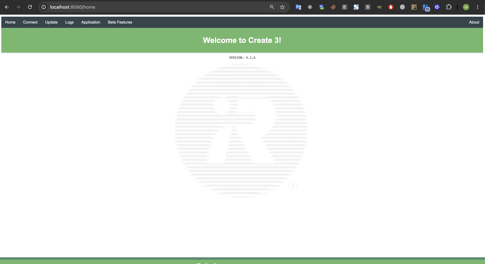

# TurtleBot4 Quick Guide

## Connect

```bash
ssh ubuntu@10.155.32.<domain_id>
```

## Remote access to Create3 dashboard

Create3's web UI lives at `192.168.186.2`, only reachable from the Pi. Tunnel it to your laptop:

```bash
ssh -L 8080:192.168.186.2:80 ubuntu@10.155.32.<domain_id>
```

Keep that open, then visit `http://localhost:8080` in your browser. You should see the Create3 dashboard like below:



Useful pages: **Application → App config** (check ROS_DOMAIN_ID matches the Pi), **Application → Restart application** (fixes missing Create3 nodes without a full reboot).

## Test checklist

```bash
ros2 node list                          # look for /motion_control, /robot_state, /_internal/*
ping -c 3 192.168.186.2                 # Pi <-> Create3 link over internal USB-C
sudo i2cdetect -y 3                     # Create3 base I2C bus
ros2 topic info /cmd_vel --verbose      # confirm /motion_control is subscribed
ros2 topic echo /wheel_status --qos-reliability best_effort --once
ros2 action send_goal /undock irobot_create_msgs/action/Undock "{}"
ros2 topic hz /scan
ros2 topic hz /oakd/right/image_raw/compressed   # or /oakd/rgb/preview/... — check with: ros2 topic list | grep oakd
ros2 action send_goal /dock irobot_create_msgs/action/Dock "{}"
```

**Notes:**
- Missing Create3 nodes → restart the Create3 app (see above), wait ~1 min.
- `i2cdetect` all `--` → check the internal cable, try reseating/different port before assuming it's broken.
- Some topics use `BEST_EFFORT` QoS (`/battery_state`, `/dock_status`, `/cmd_vel`). If `echo`/`pub` hangs, add `--qos-reliability best_effort`.
- If camera doesn't publish, it may need a manual launch:
  ```bash
  export DEPTHAI_USB2_MODE=1
  ros2 launch turtlebot4_bringup oakd.launch.py
  ```

## Teleop

```bash
ros2 run teleop_twist_keyboard teleop_twist_keyboard
```
(undock first — Create3 ignores movement commands while docked)
